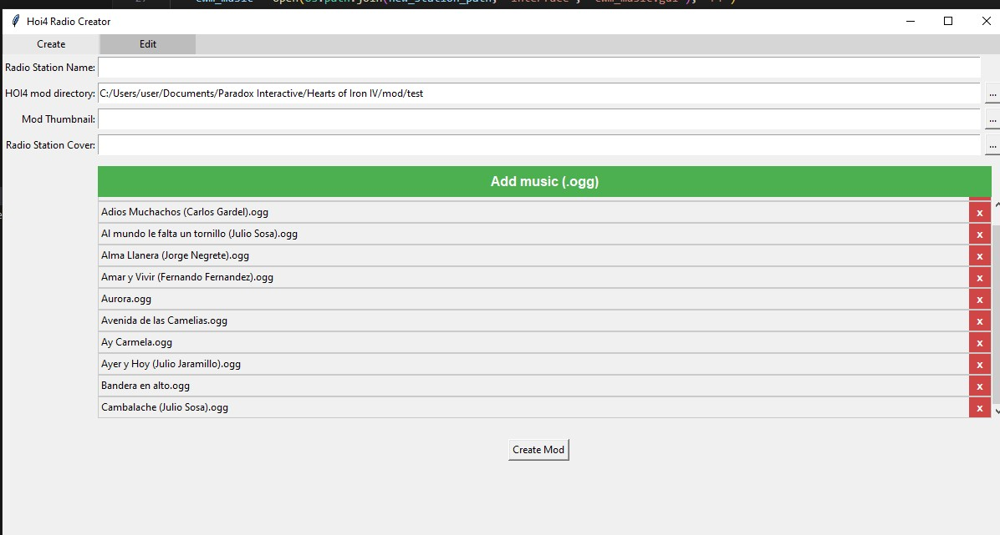

# HOI4 Radio Tool

This is a tool intended for the creation and very basic management of HOI4 radio mods that contain only one station (for the moment, maybe I might add for more stations later). This tool is in early development, there may be some bugs.

## Features
- Lets you create a customized mod directory containing the given music files.
- You can edit the existing mod directories music. 

## To add (maybe)
- Modify more than one station.
- Add tags to music so they can be only be player for specific countries or ideologies.

